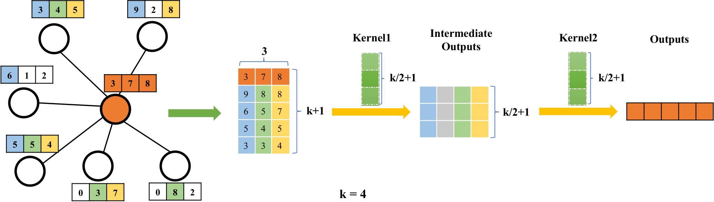
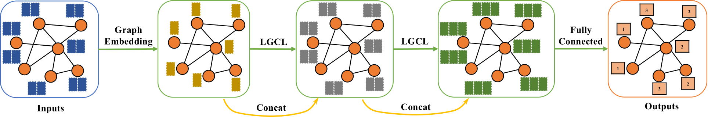
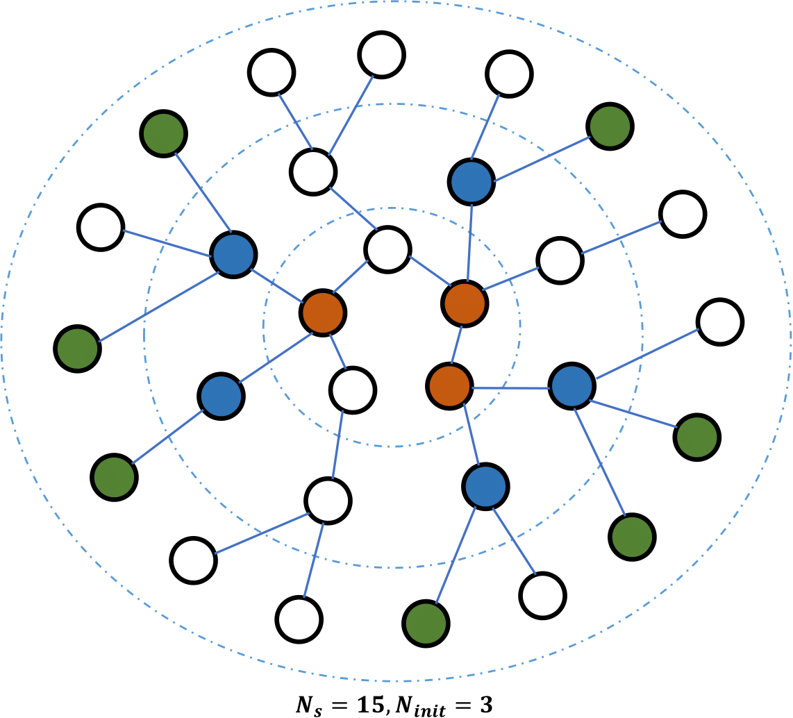

# Large-Scale Learnable Graph Convolutional Networks(LGCN)

Created by [Hongyang Gao](http://people.tamu.edu/~hongyang.gao/), [Zhengyang Wang](http://people.tamu.edu/~zhengyang.wang/) and [Shuiwang Ji](http://people.tamu.edu/~sji/) at Texas A&M University.

Accepted by KDD18.

## Introduction

Large-Scale Learnable Graph Convolutional Networks provide an efficient way (LGCL and LGCN) for learnable graph convolution.

Detailed information about LGCL and LGCN is provided in (https://dl.acm.org/citation.cfm?id=3219947).

## Methods

In this work, we propose the learnable graph convolution layer
(LGCL). Based on LGCL. We propose the learnable graph
convolutional networks.

### Learnable Graph Convolution Layer



### Learnable graph Convolutional Networks



### Batch Training



## Citation

If using this code, please cite our paper.

```
@inproceedings{gao2018large,
  title={Large-Scale Learnable Graph Convolutional Networks},
  author={Gao, Hongyang and Wang, Zhengyang and Ji, Shuiwang},
  booktitle={Proceedings of the 24th ACM SIGKDD International Conference on Knowledge Discovery \& Data Mining},
  pages={1416--1424},
  year={2018},
  organization={ACM}
}
```

## Start training

After configure the network, we can start to train. Run
```
python main.py
```
The training results on Cora dataset will be displayed.


## Results

| Models    | Cora  | Citeseer | Pubmed |
|-----------|-------|----------|--------|
| DeepWalk  | 67.2% | 43.2%    | 65.3%  |
| Planetoid | 75.7% | 64.7%    | 77.2%  |
| Chebyshev | 81.2% | 69.8%    | 74.4%  |
| GCN       | 81.5% | 70.3%    | 79.0%  |
| LGCN      |83.3 ± 0.5% | 73.0 ± 0.6% | 79.5 ± 0.2% |
